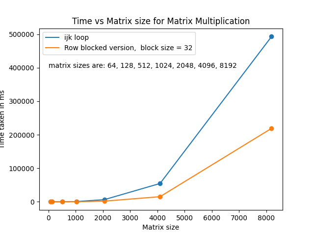
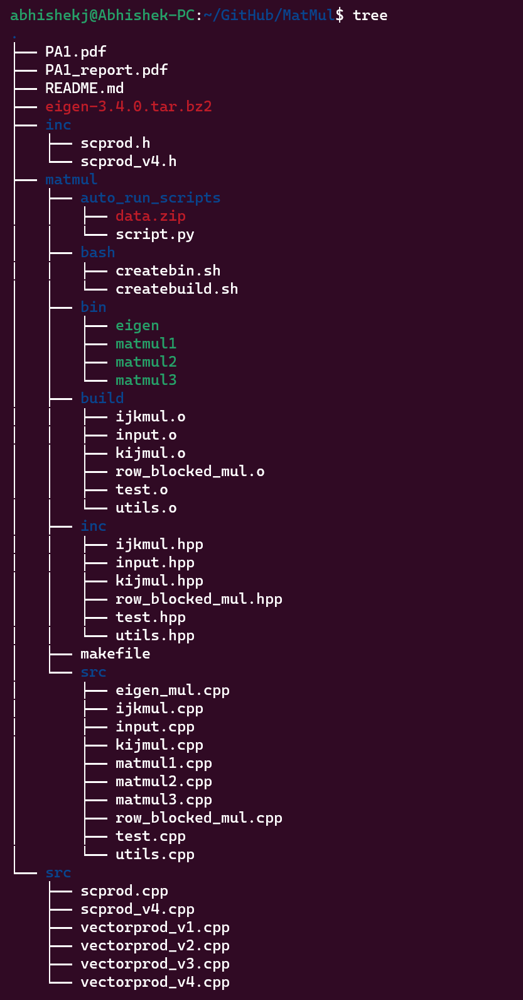

# Analysis of cache and loop unrolling on matrix multiplication

# Computational Intensity

1. Connection between computation and communication cost
2. Average number of operations performed per data element (word) read/written from slow memory
3. Computational Intensity q = f/m (flops per word).
4. Goal: we want to maximize the computational intensity

# Computational Intensity - axpy (dot prod c = c + x (dot) y)

Operations involved:
1. Read(x) //read x from slow memory
2. Read(y) //read y from slow memory
3. Read(c) //read c from slow memory

`for i=1 to n`

`c[i] = c[i] + x[i]*y[i]`

4. Write(c) //write c back to slow memor

5. Number of memory operations = 4n

6. q = computations/memory op = 2n/4n = 1/2

# Computational Intensity – matrix matrix product

## ijk loop
<code> 

    for (int i = 0; i < dim; i++){
        for (int j = 0; j < dim; j++){
            for (int k = 0; k < dim; k++){
                C[i*dim + j] += A[i*dim + k] * B[j*dim + k]; 
                // each row of A read once for each i. cost: n^2
                // Each column of B read n times including outer i loop: Cost: n^3
                //Total memory cost = n^3
            }
               
        }
    }
</code>

q = 2n^3/n^3 = 2

## Blocked matrix multiplication

<code>

    for(int blk = 0; blk < block_size; blk++){

        for (int element = 0; element < dim; element++){

            for(int blk_row = 0; blk_row < dim/block_size; blk_row++){
        
                for(int col = 0; col < dim; col++){

                    int blocked_index_row = blk*(dim/block_size)*dim + blk_row*dim + col;
                    int blocked_index_col = blk_row + element*dim + blk*(dim/block_size);
                    c[blocked_index_row] = c[blocked_index_row] + a[blocked_index_col] * b[(element*dim) + col];
        }
      }
    }
  

</code>

1. At the inner loop $C[blk][*] += A[*][k] + B[blk][*]$

2. C and B is changed row-wise and A column-wise

3. For each block A is read into memory n^2 times.

4. Memory intensity of this operation is Num_blocks * n^2

5. q = 2*n/N 

q = 2n^3/N*n^2 = 2*n/N which is better for high n

# Comparing ijk matrix multiplication vs row-blocked matrix multiplication

From the following plot we see that row blocked matmul is better than ijk loop

### For more info read PA1_report.pdf 

## Directory Structure
The root folder contains souce-code (/src) for dot product and matmul folder contains code for matrix multiplication.

